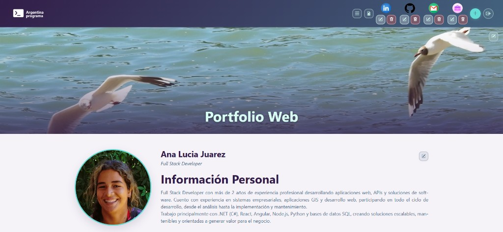
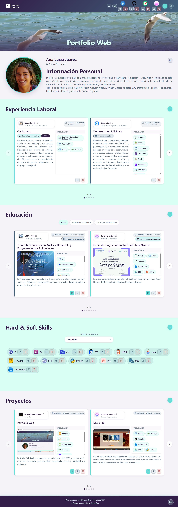
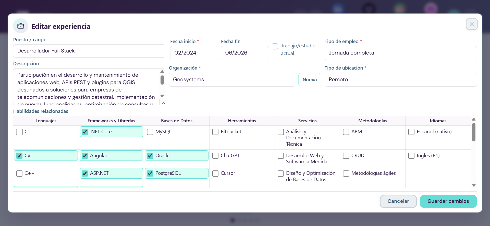
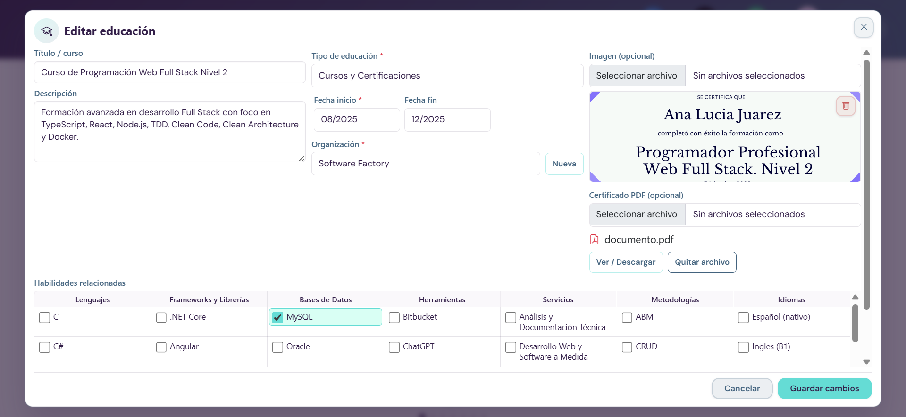
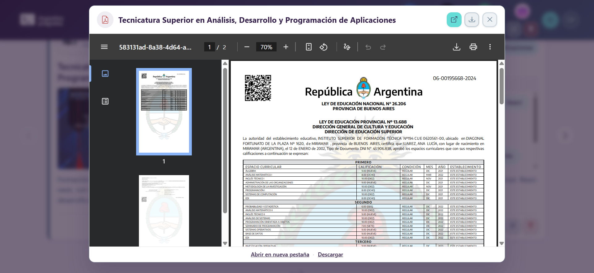
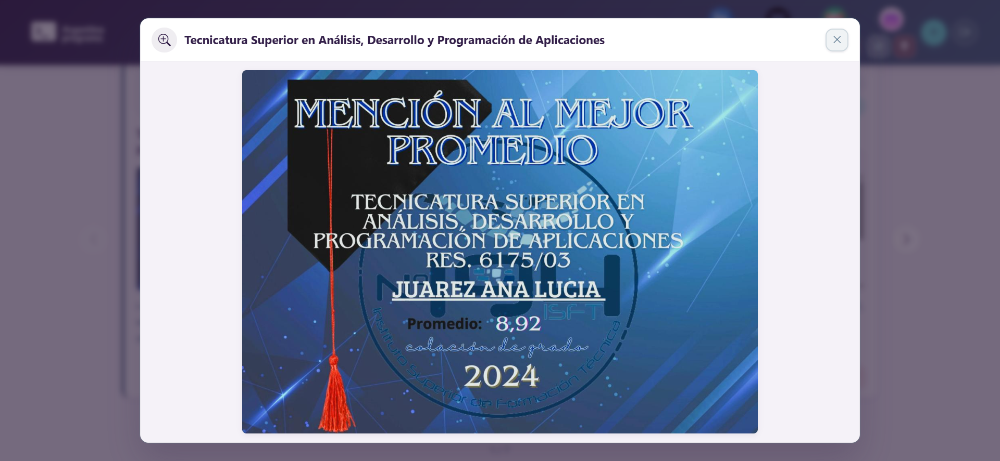
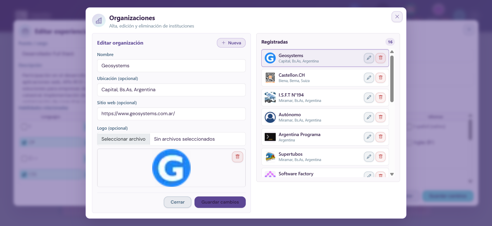

<section align="center">
    <h1 align="center">💼📚 PORTFOLIO WEB 👩‍💻💻</h1>
    
    <section align="center">
        <a href="https://github.com/manita02/PortfolioWeb"></a>
        <a href="https://github.com/manita02/PortfolioWeb"></a>
        <a href="https://github.com/manita02/PortfolioWeb"></a>
        <a href="https://github.com/manita02/PortfolioWeb"></a>
        <a href="https://github.com/manita02/PortfolioWeb"></a>
        <a href="https://github.com/manita02/PortfolioWeb"></a>
    </section>
</section>

# Índice

- [Acerca del proyecto Portfolio Web](#acerca-del-proyecto-portfolio-web)
- [Programas y software requerido](#programas-y-software-requerido)
- [Preparar el ambiente (paso a paso)](#preparar-el-ambiente-paso-a-paso)
- [Base de datos: crear BD, usuario admin y banner](#base-de-datos-crear-bd-usuario-admin-y-banner)
- [Ejecutar el backend](#ejecutar-el-backend)
- [Ejecutar el frontend](#ejecutar-el-frontend)
- [Funcionalidades](#funcionalidades)
- [Tecnologías utilizadas](#tecnologías-utilizadas)
- [Sitio web online](#sitio-web-online)
- [Capturas](#capturas)
- [Autor](#autor)

---

## Acerca del proyecto Portfolio Web

<p align="justify">
  Aplicación web <strong>full stack</strong> para mostrar y administrar un portfolio personal: datos personales, educación, experiencia laboral, habilidades (hard y soft), proyectos, redes sociales y más.
</p>

| Parte | Carpeta | Stack |
|-------|---------|-------|
| Backend | `back_local/` | Java 8 · Spring Boot 2.6 · MySQL · JWT |
| Frontend | `front_local/` | Angular 13 · TypeScript · Bootstrap 5 |

El frontend consume las APIs REST del backend. Con sesión de administrador podés editar todo el contenido desde la interfaz, exportar/importar la base de datos y descargar el CV en PDF.

---

## Programas y software requerido

Instalá lo siguiente **antes** de clonar el repositorio:

| Herramienta | Versión recomendada | Para qué sirve |
|-------------|---------------------|----------------|
| [Git](https://git-scm.com/downloads) | Última estable | Clonar el repositorio |
| [JDK](https://adoptium.net/) | 8 | Compilar y ejecutar el backend |
| [XAMPP](https://www.apachefriends.org/) | Última estable | MySQL + phpMyAdmin (incluidos) |
| [Node.js](https://nodejs.org/) | 14.x o 16.x | Ejecutar el frontend (incluye npm) |
| [Angular CLI](https://angular.io/cli) | 13.x | Servidor de desarrollo del frontend |
| [Cursor](https://cursor.com/) | — | Editor de código de preferencia |

> **Nota:** Maven no es obligatorio. El backend incluye el wrapper (`mvnw` / `mvnw.cmd`).

---

## Preparar el ambiente (paso a paso)

### 1. Clonar el repositorio

```bash
git clone https://github.com/manita02/PortfolioWeb.git
cd PortfolioWeb
```

### 2. Instalar Angular CLI 13

Abrí una terminal **como administrador** y ejecutá:

```bash
npm install -g @angular/cli@13
```

### 3. Iniciar XAMPP y abrir phpMyAdmin

1. Abrí el **Panel de control de XAMPP**.
2. Iniciá los módulos **Apache** y **MySQL** (botón **Start** en cada uno).
3. En la fila de MySQL, clic en **Admin** para abrir **phpMyAdmin** en el navegador (`http://localhost/phpmyadmin`).

<section align="center">
    
</section>

### 4. Configurar credenciales del backend

Editá `back_local/src/main/resources/application.properties` con el usuario de MySQL de XAMPP (por defecto **`root`**, sin contraseña):

```properties
spring.datasource.username=root
spring.datasource.password=
```

Si configuraste una contraseña para `root` en XAMPP, escribila en `password`. Si no tenés contraseña, dejá esa línea vacía como viene por defecto.

### 5. Imágenes grandes en la base de datos (recomendado)

Para subir imágenes de hasta **2 MB** desde el ABM, configurá MySQL una sola vez. En **phpMyAdmin** ejecutá:

```sql
SET GLOBAL max_allowed_packet = 4194304;
```

Reiniciá MySQL desde el panel de XAMPP (**Stop** → **Start**). Para dejarlo permanente, editá el archivo `my.ini` de XAMPP (botón **Config** → **my.ini** junto a MySQL) y agregá en la sección `[mysqld]`:

```ini
max_allowed_packet=4M
```

---

## Base de datos: crear BD, usuario admin y banner

### 1. Crear la base de datos vacía en phpMyAdmin

Con XAMPP activo, abrí **phpMyAdmin** (botón **Admin** en MySQL):

1. Clic en **Nueva** (panel izquierdo) o pestaña **Bases de datos**.
2. Nombre: **`backendaj`** → cotejamiento **utf8mb4_general_ci** → **Crear**.
3. **No agregues tablas manualmente.** La BD debe quedar vacía; Hibernate las crea al arrancar el backend.

### 2. Arrancar el backend una vez (crear tablas y catálogos)

Seguí los pasos de [Ejecutar el backend](#ejecutar-el-backend) para que Spring Boot + Hibernate generen el esquema.

Al iniciar, el backend ejecuta automáticamente la parte activa de `back_local/src/main/resources/data.sql` (tipos de empleo, ubicación, educación y habilidades). **No hace falta importar ese archivo a mano** en phpMyAdmin.

Cuando veas `Started AjApplication` en la consola, detené el servidor si querés continuar con los inserts de prueba.

### 3. Insertar roles, usuario admin, perfil y banner

Al final de `back_local/src/main/resources/data.sql` hay una **sección comentada** (`/* ... */`) con los datos iniciales opcionales. Spring Boot **no la ejecuta** al arrancar; está ahí como referencia para copiar en phpMyAdmin.

**Pasos:**

1. Abrí `back_local/src/main/resources/data.sql` y buscá el bloque **DATOS INICIALES OPCIONALES**.
2. Copiá todo el contenido **dentro** del comentario (desde `-- 1) Roles...` hasta el `INSERT` del banner).
3. En phpMyAdmin: seleccioná la BD **`backendaj`** → pestaña **SQL** → pegá y ejecutá.

El bloque incluye, en este orden:

| Paso | Qué inserta |
|------|-------------|
| 1 | Roles `ROLE_ADMIN` y `ROLE_USER` + usuario **admin** |
| 2 | Perfil de prueba (persona) vinculado al admin |
| 3 | Banner de prueba |

**Credenciales de acceso:** usuario `admin` / contraseña `admin`.

---

## Ejecutar el backend

Abrí una terminal en la carpeta `back_local` (desde Cursor, PowerShell, CMD o el terminal integrado de tu IDE):

```bash
cd back_local
mvnw.cmd spring-boot:run      # Windows
./mvnw spring-boot:run         # Linux / macOS
```

Si todo salió bien, en la consola deberías ver:

```
Tomcat started on port(s): 8080
Started AjApplication in X seconds
```

- **API:** `http://localhost:8080`
- **Swagger UI:** `http://localhost:8080/swagger-ui.html`

### Puerto 8080 ocupado (Windows)

```powershell
netstat -ano | findstr :8080
taskkill /PID <numero_del_pid> /F
```

---

## Ejecutar el frontend

En **otra terminal**, dentro de `front_local`:

```bash
cd front_local
npm install
npm start
```

- **App:** `http://localhost:4200`
- El frontend se conecta al backend en `http://localhost:8080`

Iniciá sesión con `admin` / `admin` para editar el contenido.

### Resumen: ejecución completa

| Paso | Qué hacer | URL |
|------|-----------|-----|
| XAMPP | Iniciar **Apache** y **MySQL** | `http://localhost/phpmyadmin` |
| Terminal 1 — Backend | `cd back_local` → `mvnw.cmd spring-boot:run` | `http://localhost:8080` |
| Terminal 2 — Frontend | `cd front_local` → `npm start` | `http://localhost:4200` |

---

## Funcionalidades

### Vista pública (sin login)

- **Banner** principal con imagen de fondo.
- **Acerca de mí:** nombre, foto, profesión y descripción.
- **Experiencia laboral:** organizaciones, periodos, modalidad y habilidades asociadas.
- **Educación:** formación académica y certificaciones, con imágenes y PDFs.
- **Hard & Soft Skills:** agrupadas por categoría con barras de progreso.
- **Proyectos:** galería con imágenes y enlaces.
- **Redes sociales** en la barra superior.
- **Descarga de CV** en PDF desde el menú del header.
- Navegación por secciones con menú responsive.

### Panel de administración (login requerido)

Con usuario **admin** podés **crear, editar y eliminar** desde modales en cada sección:

| Sección | Qué podés gestionar |
|---------|---------------------|
| Banner | Título e imagen de portada |
| Acerca de | Datos personales y foto de perfil |
| Experiencia | Puestos, organizaciones, fechas, habilidades |
| Educación | Títulos, instituciones, certificados PDF |
| Habilidades | Nombre, porcentaje, tipo e icono |
| Proyectos | Título, descripción, imagen y enlace |
| Organizaciones | Logos y datos de empresas/instituciones |
| Redes sociales | Enlaces e iconos |

### Importación y exportación de base de datos (backend)

Funcionalidad pensada para **respaldar, migrar o restaurar** todo el contenido del portfolio sin perder datos.

Disponible en el **footer** (ícono de disco 💾), solo visible para el rol **ADMIN**:

| Acción | Endpoint backend | Descripción |
|--------|------------------|-------------|
| **Exportar BD** | `GET /api/backup/download` | Genera y descarga un archivo `.sql` con todas las tablas y datos |
| **Importar BD** | `POST /api/backup/upload` | Sube un `.sql` compatible; limpia la BD e importa el contenido |

**Cómo usarlo desde la interfaz:**

1. Iniciá sesión como `admin`.
2. En el footer, clic en el ícono de base de datos.
3. Elegí **Exportar BD** para descargar un backup, o **Importar BD** para restaurar uno previo.
4. Esperá a que termine la barra de progreso **sin cerrar ni recargar** la página.

Los archivos exportados siguen el formato generado por el backend y son compatibles con la importación del mismo sistema (hasta **25 MB**).

### Otras funcionalidades del backend

- Autenticación **JWT** con roles `ADMIN` y `USER`.
- APIs REST documentadas en **Swagger**.
- Validación de archivos (imágenes ~2 MB, PDFs, banners hasta ~750 KB recomendado).
- Catálogos precargados vía `data.sql` (tipos de empleo, ubicación, educación y habilidades).

---

## Tecnologías utilizadas

| [<br><sub>Java</sub>](https://www.java.com/en/download/help/whatis_java.html) | [<br><sub>MySQL</sub>](https://www.mysql.com/) | [<br><sub>Node.js</sub>](https://nodejs.org/) | [<br><sub>TypeScript</sub>](https://www.typescriptlang.org/) | [<br><sub>Angular</sub>](https://angular.io/) | [<br><sub>HTML</sub>](https://developer.mozilla.org/es/docs/Web/HTML) | [<br><sub>CSS</sub>](https://developer.mozilla.org/es/docs/Web/CSS) | [<br><sub>Bootstrap</sub>](https://getbootstrap.com/) |
| :---: | :---: | :---: | :---: | :---: | :---: | :---: | :---: |
| [<br><sub>Cursor</sub>](https://cursor.com/) | [<br><sub>XAMPP</sub>](https://www.apachefriends.org/) | [<br><sub>phpMyAdmin</sub>](https://www.phpmyadmin.net/) | [<br><sub>Spring Boot</sub>](https://spring.io/projects/spring-boot) | [<br><sub>Git</sub>](https://git-scm.com/) | [<br><sub>Maven</sub>](https://maven.apache.org/) |

---

## Sitio web online

Podés ver el portfolio desplegado en:

**[https://portfolioweb-analuciajuarez.pages.dev/](https://portfolioweb-analuciajuarez.pages.dev/)**

---

## Capturas

<sub>Hacé clic en cualquier captura para verla en tamaño completo.</sub>

<table>
  <tr>
    <td width="32%" align="center" valign="top">
      <strong>Vista general (Home)</strong><br>
      <sub>Banner, secciones y footer</sub><br><br>
      <a href="docs/capturas/home_completo.png" target="_blank">
        
      </a>
    </td>
    <td width="68%" align="center" valign="top">
      <table width="100%">
        <tr>
          <td align="center" valign="top" style="padding-bottom: 12px;">
            <strong>Edición de experiencia laboral</strong><br>
            <sub>Puesto, fechas, organización y habilidades</sub><br>
            <a href="docs/capturas/editar_experiencia.png" target="_blank">
              
            </a>
          </td>
        </tr>
        <tr>
          <td align="center" valign="top" style="padding-bottom: 12px;">
            <strong>Edición de educación</strong><br>
            <sub>Certificado, PDF adjunto y skills vinculadas</sub><br>
            <a href="docs/capturas/editar_educacion.png" target="_blank">
              
            </a>
          </td>
        </tr>
        <tr>
          <td align="center" valign="top" style="padding-bottom: 12px;">
            <strong>Visor de certificado PDF</strong><br>
            <sub>Analítico / certificado desde educación</sub><br>
            <a href="docs/capturas/viewer_pdf.png" target="_blank">
              
            </a>
          </td>
        </tr>
        <tr>
          <td align="center" valign="top">
            <strong>Visor de imagen de certificado</strong><br>
            <sub>Ampliación de diploma o mención en modal</sub><br>
            <a href="docs/capturas/viewer_img_certificado.png" target="_blank">
              
            </a>
          </td>
        </tr>
      </table>
    </td>
  </tr>
  <tr>
    <td colspan="2" align="center" valign="top" style="padding-top: 16px;">
      <strong>Gestión de organizaciones (ABM)</strong><br>
      <sub>Alta, edición y eliminación de instituciones</sub><br><br>
      <a href="docs/capturas/abm_organizaciones.png" target="_blank">
        
      </a>
    </td>
  </tr>
</table>

---

## Autor

| [<br><sub>Ana Lucia Juarez</sub>](https://github.com/manita02) |
| :---: |
